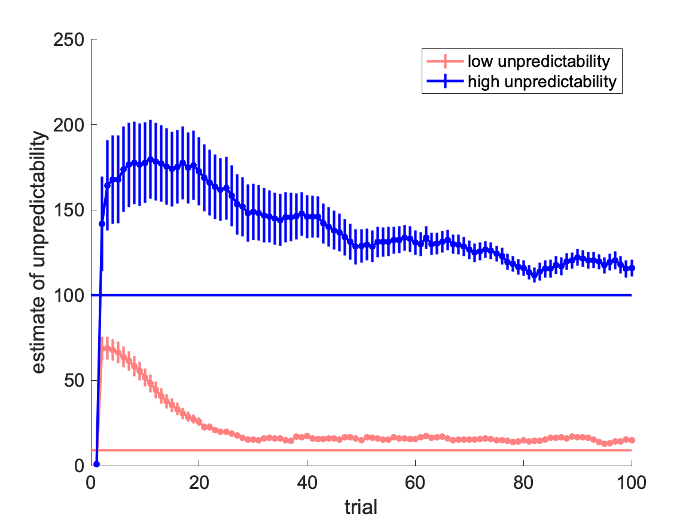

# Tracking-unpredictability-in-the-basal-ganglia

Inspired by [***Unpredictability vs. volatility and the control of learning***](https://www.biorxiv.org/content/10.1101/2020.10.05.327007v2.full) (Payam Piray, Nathaniel D. Daw).



A kalman filter needs accurate estimates of unpredictability and volatility to optimally infer the true state of the signal it tracks. Humans and animals that use a Kalman filter to track rewards would need to learn unpredictability and volatility from their observations. Piray and Daw present a model that does this, and investigate the behaviour and implications of this model.

A particle filter is used to track uncertainty, but--incontrast to volatility--it is not clear how the brain would implement an algorithm like this.

> Accordingly, work on the neural substrates of volatility and changepoint detection is highly relevant [...], whereas the brain systems specifically underlying unpredictability are less clear.

***

However, there is a line of research that suggests the basal ganglia might be tracking unpredictability:

1. [***Learning uncertainty in the basal ganglia***](https://journals.plos.org/ploscompbiol/article?id=10.1371/journal.pcbi.1005062): how reward uncertainty might be tracked.

2. [***Learning the payoffs and costs of actions***](https://journals.plos.org/ploscompbiol/article?id=10.1371/journal.pcbi.1006285): how the same process can estimate payoffs and costs.

3. [***Reward prediction errors induce risk seeking***](https://www.biorxiv.org/content/10.1101/2020.04.29.067751v1): behavioural consequences of tracking uncertainty?

***

Here, substitute the particle filter of Piray and Daw with a biologically plausible learning rules from above reference. The figure at the top of the page relates to Fig 3 of Piray and Daw. It shows that it provides a reasonable estimate of variance (solid lines are true level of unpredictability, error bars obained from 50 simulations of 100 consequtive trials).

### Learning rule used

$$
u_{t+1} = u_{t} + \alpha (\delta_{t}^2 - u_{t})
$$


### Reproduce result

* Clone repo

  ```bash
  git clone https://github.com/MoritzMoeller/Tracking-unpredictability-in-the-basal-ganglia
  ```

* Open Matlab and run simulate_learnvar_kalman.m


